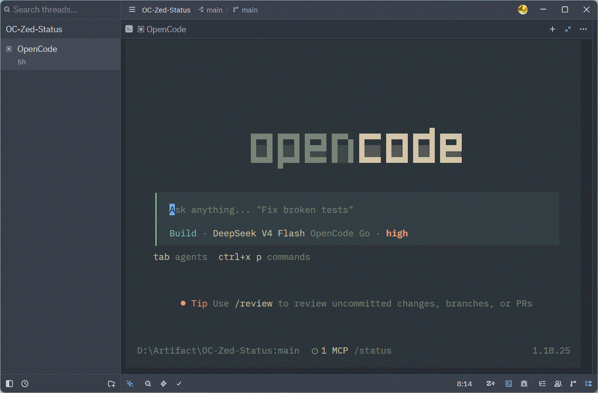

# opencode-zed-status

[English](README.md) | [简体中文](README.zh-CN.md)

为 [opencode](https://opencode.ai) 提供 Zed 终端状态反馈的 TUI 插件(零依赖、单文件):

| 文件 | 导出 | 作用 |
|---|---|---|
| `zed-bell.js` | `bellTui` | 任务完成 / 等待授权时向终端写 BEL(`\x07`),Zed 未聚焦时弹通知 + 蓝点 |
| `zed-title.js` | `titleTui` | 终端标题(OSC 0):空闲显示静态图标 `▣`,busy / retry 时轮换 spinner 帧覆盖 |

两者互不冲突(BEL vs OSC 0),可同时使用。

## 安装

### 方式一:npm(推荐)

```sh
opencode plugin add opencode-zed-status
```

或手动在 `~/.config/opencode/tui.json` 的 `plugin` 数组中加入包名后重启:

```json
{
  "plugin": ["opencode-zed-status"]
}
```

> 注意:TUI 插件的配置在 `tui.json`,不是 `opencode.json`;`opencode plugin add` 在部分版本有 bug(只打印 help),此时请直接编辑 `tui.json`。

### 方式二:本地文件

下载 `zed-bell.js` / `zed-title.js` 到任意目录,然后在 `tui.json` 中按路径声明(TUI 插件**没有**目录自动发现):

```json
{
  "plugin": ["D:/path/to/zed-bell.js", "D:/path/to/zed-title.js"]
}
```

**任一方式完成后重启 opencode 生效。**

## 使用

在 Zed 的 Terminal Threads 中正常使用 opencode 即可,无需额外配置:



- 静态图标:空闲时标题为 `▣ OC | 标题`,Zed 的 Threads Sidebar 会在图标位显示 `▣`(与 opencode 官方 mark 同构)
- 忙碌动画:busy / retry 时左侧轮换四象限块(`▘ ▝ ▗ ▖`,200ms/帧),Zed 图标位同步显示旋转帧
- 自动恢复:标题采用轮询写入,任何时刻被其他来源覆盖(切换会话、`/new`、复制文本等),≤1s 内自动恢复 `▣` 前缀
- 响铃:任务完成或等待授权时终端响铃,未聚焦时 Zed 弹通知
- 标题截断 40 字符,保留 `OC |` 前缀
- 静态图标固定为 `▣`(与 opencode 官方 mark 同构),不可切换

### 禁用

- 环境变量 `OPENCODE_DISABLE_TERMINAL_TITLE=1` 禁用标题功能
- TUI 设置中的 "Disable terminal title" 开关同样生效(`terminal_title_enabled`)

## 卸载

- npm 方式:从 `tui.json` 移除 `opencode-zed-status` 并重启
- 本地方式:从 `tui.json` 移除对应文件路径并重启

注意:两种方式不要混用,否则插件会加载两份(双动画/双响铃)。